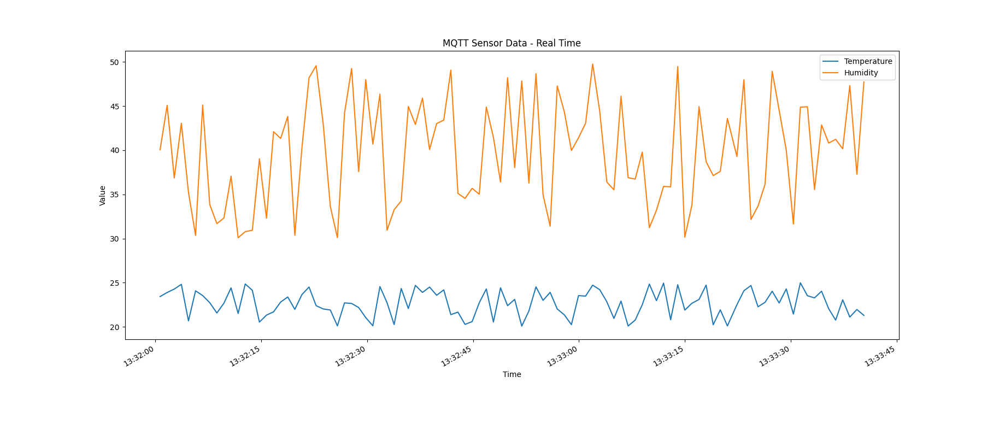
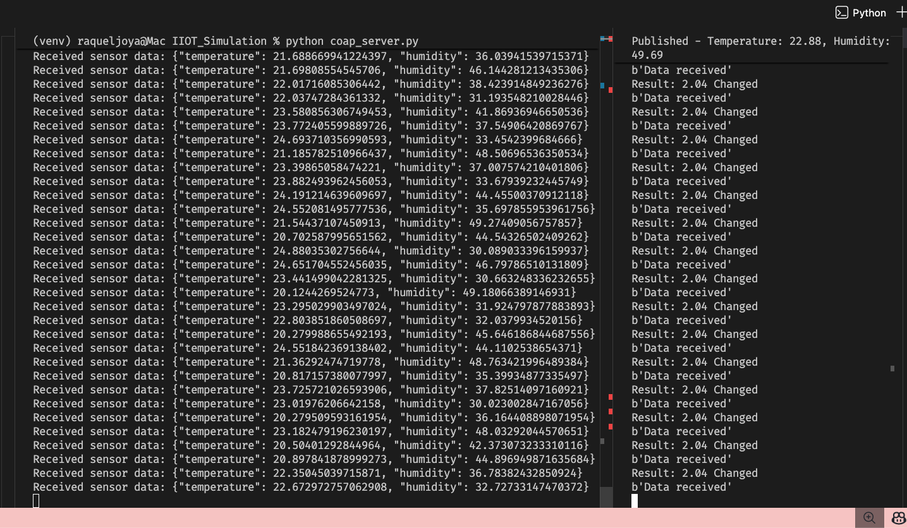
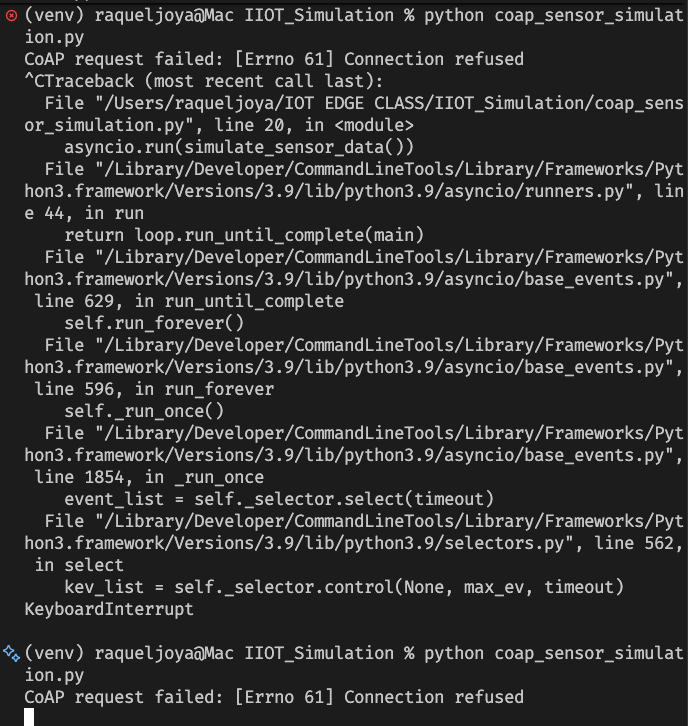
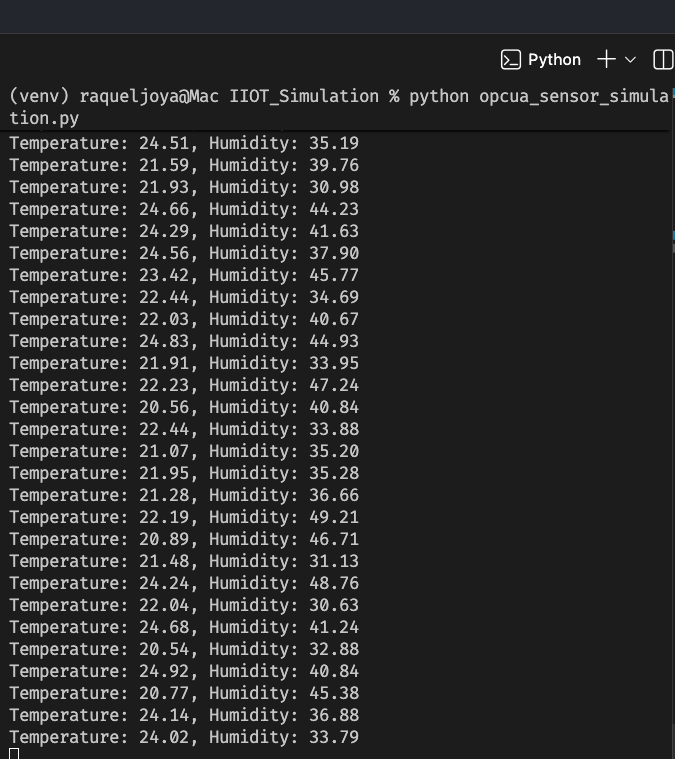

# Visualizations — IIoT Protocol Simulations

This folder contains visual outputs generated from the MQTT, CoAP, and OPC-UA protocol simulations completed in Lab 04.

## Demo Video

[▶ Watch the full simulation demo](visualization_demo.mp4)

> Click the link above to view the recorded walkthrough of all three protocol simulations running live.

---

## Protocol Visualization Screenshots

| MQTT | CoAP | CoAP (No Server Error) | OPC-UA |
|------|------|------------------------|--------|
|  |  |  |  |

---

*ITAI 3377 — IoT & Edge Computing | Monica Joya | Group 7*
